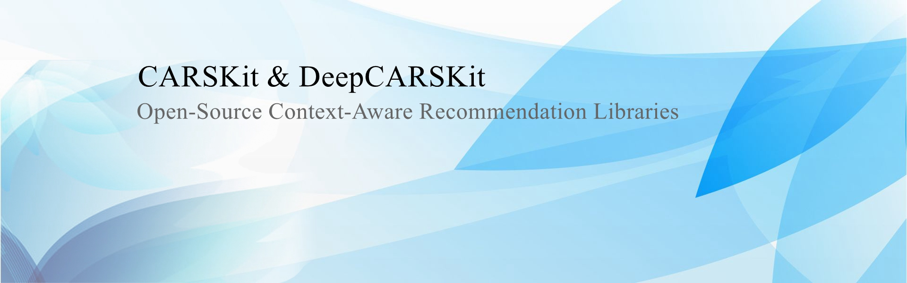
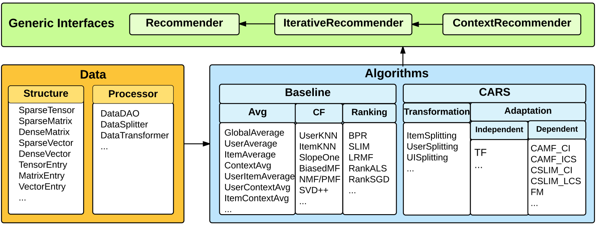

# CARSKit

*A Java Based Context-Aware Recommendation Engine*

[](http://perso.crans.org/besson/LICENSE.html)
[](https://www.oracle.com/java/technologies/javase/javase7-archive-downloads.html)
[](https://carskit.github.io/)
[](https://scholar.google.com/citations?view_op=view_citation&hl=en&citation_for_view=0FENWMcAAAAJ:ML0RJ9NH7IQC)
[](https://doi.org/10.1109/ICDMW.2015.222)
[](https://twitter.com/DeepCARSKit)

[](https://carskit.github.io/)

### Introduction
-------------------

**[CARSKit](https://github.com/irecsys/CARSKit/)** is an open-source Java-based context-aware recommendation engine, where it can be used, modified and distributed under the terms of the GNU General Public License. (Java version 1.7 or higher required). It is specifically designed for context-aware recommendations. 

**[DeepCARSKit](https://github.com/irecsys/DeepCARSKit/)** is an open-source deep-learning based context-aware recommendation library under MIT License.  It is specifically designed for context-aware recommendations. 


### GPL License
-------------------

CARSKit is [free software](http://www.gnu.org/philosophy/free-sw.html): you can redistribute it and/or modify it under the terms of the [GNU General Public License (GPL)](http://www.gnu.org/licenses/gpl.html) as published by the Free Software Foundation, either version 3 of the License, or (at your option) any later version. CARSKit is distributed in the hope that it will be useful, but WITHOUT ANY WARRANTY; without even the implied warranty of MERCHANTABILITY or FITNESS FOR A PARTICULAR PURPOSE. See the GNU General Public License for more details. You should have received a copy of the GNU General Public License along with CARSKit. If not, see http://www.gnu.org/licenses/.

### Architecture and Design
----------------------------

[](https://carskit.github.io/)

### Algorithms
---------------

* **Traditional recommendation algorithms**: The implementations of those algorithms (such as UserKNN, BiasedMF, SVD++, SLIM, etc) are from LibRec-V1.3. Those algorithms can be used in two ways: 1). run a traditional recommendation algorithm directly on the context-aware data set to compete with the context-aware recommendation algorithms; 2). run contextual recommendation algorithms based on transformation, e.g., run a traditional recommendation algorithm after data transformation (e.g., by item splitting).
* **Context-aware recommendation algorithms**: CARSKit simply divides it into two categories: Transformation Algorithms and Adaptation Algorithms. The transformation algorithms try to convert the mulidimensional recommendation problem into traditional 2-dimensional problem, so that the traditional recommendation algorithms can still be used. In contrast to those algorithms based on transformation algorithms, the adaptation algorithms focus on their effect on building algorithms by adapting to the multidimensional rating space. Most of the algorithms inside belong to the contextual modeling algorithms, such as Context-aware Matrix Facatorization (CAMF), Tensor Factorization (TF), Contextual Sparse Linear Method (CSLIM), Factorization Machines (FM), etc.

### Reference
-------------

Please cite the following papers if you use CARSKit in your research:

* Yong Zheng, Bamshad Mobasher, Robin Burke. "CARSKit: A Java-Based Context-aware Recommendation Engine", Proceedings of the 15th IEEE International Conference on Data Mining (ICDM) Workshops, pp. 1668-1671, Atlantic City, NJ, USA, Nov 2015

```
@inproceedings{zheng2015carskit,
  title={Carskit: A java-based context-aware recommendation engine},
  author={Zheng, Yong and Mobasher, Bamshad and Burke, Robin},
  booktitle={2015 IEEE International Conference on Data Mining Workshop (ICDMW)},
  pages={1668--1671},
  year={2015},
  organization={IEEE}
}
```
### Downloads (Latest)
* **[CARSKit-v0.3.5.jar](https://github.com/irecsys/CARSKit/raw/master/jar/CARSKit-v0.3.5.jar)**
* **[Configuration file](https://raw.githubusercontent.com/irecsys/CARSKit/master/setting.conf)**

### Data Sets
--------------

A list of context-aware data sets can be found here: https://github.com/irecsys/CARSKit/tree/master/context-aware_data_sets <br/>

### User's Guide
--------------
The CARSKit guide can be found and downloaded from [here](http://arxiv.org/abs/1511.03780). The Java API doc can be found and viewed from [here](https://carskit.github.io/doc/CARSKit).

Note: if there are missing values or EMPTY values in the context information, you should mark those values as NA (i.e., Not Available) which will be viewed as a special context condition in the data.


### Acknowledgement
--------------------

I would like to show our gratitude to Dr. Guibing Guo (the author of LibRec) for his comments and suggestions on the development of CARSKit.


### Release Notes
------------------
**2019/02/18, Version 0.3.5**
* Fix the issue in top-N recommendation evaluations. It evaluates top-5 and top-10 by default. In addition, you can set up a new value for N, so that CARSKit will produce top-N recommendation results based on top-5, 10 and N.
* Fix the issue in the train-test evaluations when you explicitly supply training and testing set in the configuration file. In CARSKit v0.3.5, the transformation process will go through both training and testing set, and produce transformed files with consistent formats.
* Add a new folder "sampleData" in which you can find the data sets in different formats. CARSKit is able to handle all types of the data formats now.
* Set similarity-based context-aware recommendation algorithms as top-N recommendation methods. Due to that fact that we did not use projected or bounded gradient method in the ICS/LCS/MCS methods, the predicted scores will not be in the original scale. The score can be used to rank items, but it is not appropriate to evaluate these methods in the rating prediction task.
* API documents and CARSKit guide (http://arxiv.org/abs/1511.03780) have been updated.

**2016/05/04, Version 0.3.0**
* BugFix in some algorithms
* Add more contextual filtering algorithms: ExactFiltering, DCR and DCW
* Add "-fullstat" in configuration which allows the kit to present more details on data statistics
* Add "-minlenu" and "-minleni" to setup "recommender=usersplitting -traditional biasedmf -minlenu 2 -minleni 2"
* Update corresponding JavaDoc and JAR library

**2016/04/18, Version 0.2.4**
* BugFix in Tensor Factorization
* Add a contextual PreFiltering algorithm: SPF (Semantic PreFiltering)
* Update corresponding JavaDoc and JAR library
* Change the evaluation process when you set a rating threshold for TopN recommendation

**2015/11/09, Version 0.2.0**
* add Tensor Factorization (CPTF) into CARSKit
* update API documents and the configuration file setting.conf
* release user's guide, "A User's Guide to CARSKit"
* optimize the coding

**2015/09/25, Version 0.1.0 (Initial Release)**


